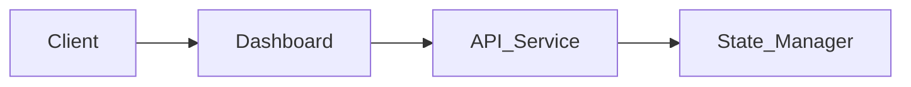

# Distributed SQL Database Dashboard

A comprehensive monitoring dashboard for distributed SQL database clusters, providing real-time visualization of node health, replication status, and system performance metrics.

## Features

- **Cluster Overview:** Real-time monitoring of coordinator and node health, including leader/replica status and shard distribution.
- **System Metrics:** Tracks query counts, average latency, active connections, and cluster-wide health scores.
- **Interactive UI:** Built with modern React components for responsive data visualization and state management.

## Tech Stack

- **Framework:** React 18
- **Language:** TypeScript
- **Build Tool:** Vite
- **State Management:** Zustand
- **Data Fetching:** TanStack React Query
- **Styling:** Tailwind CSS, Framer Motion
- **Components/Icons:** Radix UI, Lucide React, Recharts

## Architecture



## Installation

### Prerequisites

- Node.js (v18 or higher)
- npm or yarn

### Step-by-Step Setup

1. Clone the repository:
   ```bash
   git clone <repository-url>
   cd frontend-distributed-sql-db
   ```

2. Install dependencies:
   ```bash
   npm install
   ```

3. Start the development server:
   ```bash
   npm run dev
   ```

### Environment Variables

No specific environment variables are currently required for the mock service implementation.

## API Documentation

The dashboard consumes data from the following internal services:

### Cluster Management
- **GET** `/api/cluster`
  - Description: Fetches the current state of the cluster, including node roles, health status, and replication factor.
  - Response:
    ```json
    {
      "coordinator": { "id": "coord-1", "health": "healthy" },
      "nodes": [{ "id": "node-1", "role": "leader", "cpu": 42, "health": "healthy" }],
      "replicationFactor": 3
    }
    ```

### Metrics
- **GET** `/api/metrics`
  - Description: Retrieves real-time performance metrics for the cluster.
  - Response:
    ```json
    {
      "queryCount": 14283,
      "averageLatency": 2.4,
      "clusterHealth": 99.7,
      "activeConnections": 8
    }
    ```

### System Health
- **GET** `/api/health`
  - Description: Checks the operational status of the API service.
  - Response:
    ```json
    { "status": "healthy", "message": "All nodes operational" }
    ```

## Project Structure

```text
src/
├── components/     # UI components
├── lib/            # Shared utilities
├── services/       # API integration logic
├── types/          # TypeScript definitions
```

## Contributing

1. Fork the repository.
2. Create your feature branch (`git checkout -b feature/amazing-feature`).
3. Commit your changes (`git commit -m 'Add some amazing feature'`).
4. Push to the branch (`git push origin feature/amazing-feature`).
5. Open a Pull Request.

## License

This project is licensed under the MIT License.